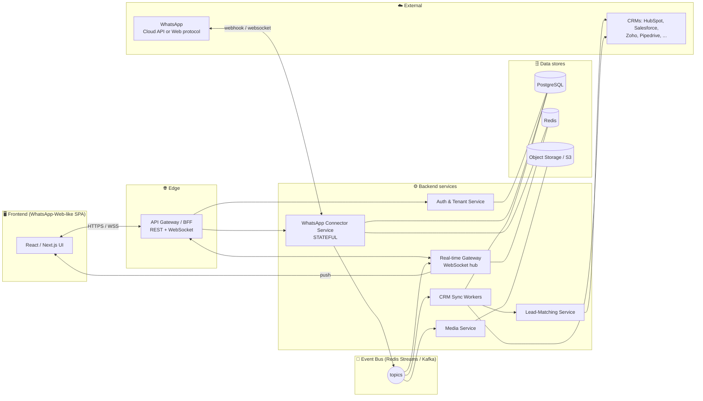
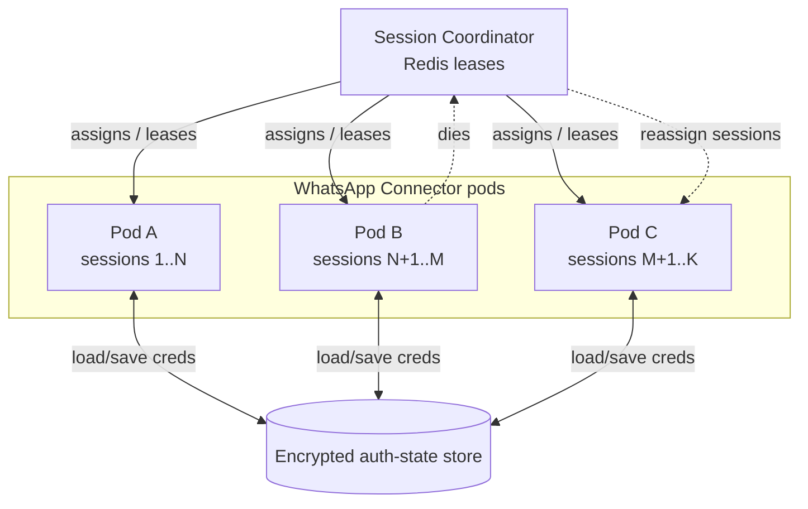
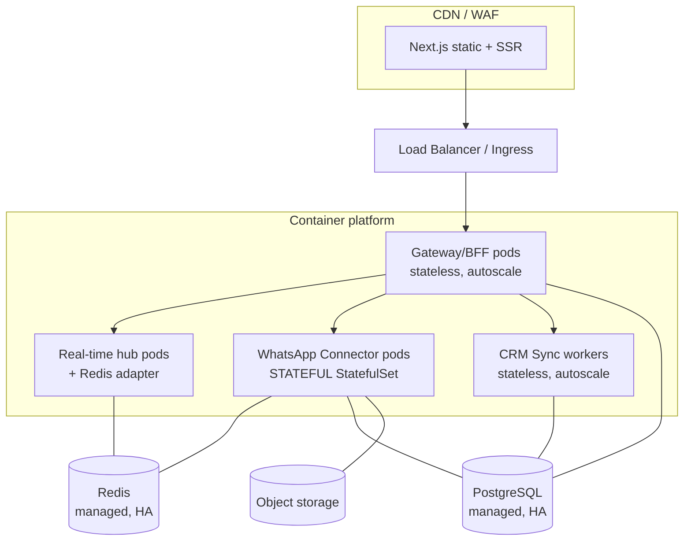

# 02 — System Architecture

How the platform is actually built: components, technologies, diagrams, and the operational
problems that decide whether it survives contact with production.

---

## 1. Architectural principles

1. **Provider-agnostic WhatsApp layer.** Everything behind a `WhatsAppConnector` interface
   so Path A / Path B (see [01](01-feasibility-and-legal.md)) are swappable.
2. **CRM-agnostic sync layer.** A canonical internal model + pluggable per-CRM adapters.
3. **Event-driven core.** WhatsApp events → message bus → consumers (persistence, real-time
   push, CRM sync). Decoupling = resilience + independent scaling.
4. **Multi-tenant from day one** (even if you launch single-tenant) so it's not a rewrite.
5. **Stateful where unavoidable, stateless everywhere else.** Isolate the stateful
   WhatsApp sessions; keep the rest horizontally scalable.

---

## 2. High-level architecture

**One-line read:** the UI talks to a gateway; the gateway talks to a stateful WhatsApp
connector and a real-time hub; WhatsApp events flow onto a bus; consumers persist them, push
them live to the UI, and sync them to the right CRM record.

---

## 3. Component-by-component

### 3.1 Frontend — the WhatsApp-Web-like SPA
- **Stack:** React + TypeScript, **Next.js**, **TailwindCSS**, a lightweight state store
  (**Zustand** or Redux Toolkit), **Socket.IO**/native WebSocket client, TanStack Query for
  server state.
- **Key screens:** QR-login / connection status, chat list (with unread, search), conversation
  thread (text, media, voice notes, status ticks), composer (text, attachments, emoji), and a
  **CRM side-panel** showing the matched lead/contact + sync status + quick actions.
- **Real-time:** subscribes to a per-tenant/per-conversation channel; optimistic send with
  reconciliation on ack.

### 3.2 API Gateway / BFF (Backend-for-Frontend)
- Single entry point. Terminates TLS, authenticates requests (JWT), rate-limits, routes to
  services, and hosts/forwards the WebSocket upgrade.
- **Stack:** Node.js + **NestJS** (or Fastify). NestJS gives structure (modules, DI, guards)
  that pays off in a multi-service codebase.

### 3.3 WhatsApp Connector Service ⚠️ *the stateful heart*
- Implements the `WhatsAppConnector` interface (see [01 §3](01-feasibility-and-legal.md)).
- **Path B (Baileys):** maintains a **live WebSocket session per connected number**, holds
  auth/crypto state, emits inbound message/status events, exposes `sendMessage`. Generates
  the **QR** for linking and handles re-link on disconnect.
- **Path A (Cloud API):** stateless-ish — a **webhook receiver** (verifies Meta signature)
  + a Graph API client for sending. Much easier to scale.
- **Must be Node.js** because Baileys/whatsapp-web.js are Node libraries. Even on Path A,
  keeping the connector in Node keeps the interface uniform.
- This service's scaling and state model is the project's hardest ops problem → **§5**.

### 3.4 Real-time Gateway (WebSocket hub)
- Pushes new messages, status changes (sent/delivered/read), and connection state to
  connected browsers.
- **Stack options:** self-host **Socket.IO** with the **Redis adapter** (so multiple hub
  instances share state), or buy a managed service (**Ably**, **Pusher**, **Supabase
  Realtime**) to skip the ops. For an MVP, managed saves weeks.

### 3.5 Event Bus
- Decouples ingestion from processing. Producers: WhatsApp Connector. Consumers: persistence,
  real-time push, CRM sync, media download.
- **Stack:** start with **Redis Streams** (you already run Redis; consumer groups give
  at-least-once + replay). Graduate to **Kafka** or **RabbitMQ** at high volume / when you
  need stronger durability and partitioning.

### 3.6 CRM Sync Workers
- Consume message/conversation events and write to the correct CRM via the **adapter layer**
  (full design in [03](03-api-and-data-design.md)).
- **Idempotent**, retried with exponential backoff, with a **dead-letter queue** for poison
  messages. This is background work — never block message delivery on CRM availability.

### 3.7 Lead-Matching Service
- Resolves a WhatsApp identity (E.164 phone / `wa_id`) → a CRM contact/lead. Handles
  find-or-create, dedup, and fuzzy matching. Detailed in [03 §5](03-api-and-data-design.md).

### 3.8 Media Service
- Downloads inbound media (images, voice, docs) from WhatsApp (URLs/keys expire fast →
  fetch promptly), stores in object storage, generates thumbnails, serves via signed URLs.

### 3.9 Auth & Tenant Service
- User identity, sessions, RBAC, tenant isolation, and storage of **CRM OAuth tokens** and
  **WhatsApp session credentials** (encrypted). See [04](04-security-privacy-compliance.md).

---

## 4. Data stores

| Store | Technology | Holds |
|---|---|---|
| Primary DB | **PostgreSQL** | tenants, users, connections, contacts, conversations, **message metadata**, CRM config, lead mappings, sync log, audit log |
| Cache / session / bus | **Redis** | WhatsApp session state cache, presence, QR codes (TTL), rate-limit counters, Redis Streams bus, Socket.IO adapter |
| Object storage | **S3 / MinIO / GCS** | media blobs + thumbnails |
| Search *(optional, later)* | **OpenSearch / Postgres FTS** | full-text message search |

**Why Postgres for messages:** it's plenty for millions of rows with proper indexing and
**table partitioning** (by month or by tenant). Reach for a columnar/NoSQL store only when
volume genuinely demands it — don't over-engineer at MVP.

---

## 5. ⚠️ The stateful-session problem (read this twice)

This is the part teams underestimate and the reason a naive "just scale the pods" approach
fails on **Path B**.

**The problem:** Each connected WhatsApp number is a **long-lived, stateful session** — a
persistent WebSocket to WhatsApp plus negotiated crypto/auth state. You **cannot** load-
balance requests for one number across a stateless pool, because only the pod that *owns*
that live session can send/receive for it.

**What this forces you to design:**

1. **Session affinity / ownership.** A coordinator assigns each connected number to exactly
   one connector pod. Use a **Redis-based lock / lease** (e.g., `SET NX` with TTL) so a number
   has a single owner; renew the lease as a heartbeat.
2. **Persistent, encrypted auth state.** Baileys auth credentials must be **persisted**
   (Postgres/Redis, encrypted) so a session survives pod restarts and can resume without a
   fresh QR scan every time. Losing this = every user must re-scan. Treat it as precious.
3. **Reconnect & re-link flow.** Sessions drop (network, WhatsApp restarts, phone offline
   too long). The connector must auto-reconnect; if the link is invalidated, surface a
   **"re-scan QR"** state to the user gracefully.
4. **Horizontal scaling model.** Scale by adding connector pods, each owning *N* sessions
   (capacity-bound by memory/CPU — especially with whatsapp-web.js, where each session is a
   headless Chromium = heavy; Baileys is far lighter, so **prefer Baileys for density**).
5. **Rebalancing & failover.** If a pod dies, its leases expire and another pod claims its
   sessions (and resumes from persisted auth state). Plan this; don't discover it in prod.
6. **Capacity planning.** Baileys: hundreds–low-thousands of sessions per beefy node.
   whatsapp-web.js: tens per node (browser overhead). This directly drives infra cost.

> On **Path A**, almost none of this applies — sending is stateless Graph calls and inbound
> is webhooks. This operational simplicity is a real, often-overlooked argument *for* Path A
> at scale.

---

## 6. Recommended technology stack (summary)

| Layer | Recommended | Alternatives |
|---|---|---|
| Frontend | React + TS, Next.js, Tailwind, Zustand, Socket.IO client | Vue/Nuxt, SvelteKit |
| Backend framework | Node.js + TypeScript + **NestJS** | Fastify, Express |
| WhatsApp (Path B) | **Baileys** | whatsapp-web.js, WPPConnect |
| WhatsApp (Path A) | Meta Cloud API direct, or BSP (Twilio/360dialog) | Gupshup, Infobip |
| Real-time | Socket.IO + Redis adapter | Ably, Pusher, Supabase Realtime |
| Event bus | Redis Streams → Kafka/RabbitMQ | NATS, AWS SQS/SNS |
| Primary DB | PostgreSQL (+ Prisma or TypeORM) | — |
| Cache/session | Redis | — |
| Object storage | S3 / MinIO | GCS, R2 |
| Auth | Clerk/Auth0/Supabase Auth, or self-managed JWT | Keycloak |
| Secrets | Cloud KMS / HashiCorp Vault | Doppler |
| Containerization | Docker | — |
| Orchestration | Kubernetes *(at scale)* / ECS / Fly.io / Render *(start)* | Nomad |
| IaC | Terraform | Pulumi |
| Observability | Prometheus + Grafana, Sentry, OpenTelemetry | Datadog |
| CI/CD | GitHub Actions | GitLab CI |

> **Why a Node/TypeScript monorepo:** the unofficial WhatsApp libraries are Node-only, the
> frontend is TS, and a shared `packages/` for the canonical types/contracts keeps the
> WhatsApp-Connector and CRM-adapter interfaces honest across services.

---

## 7. Deployment topology

- **Stateless tiers** (gateway, sync workers): standard horizontal autoscaling.
- **Connector tier:** deploy as a **StatefulSet** (stable identity for lease ownership);
  scale deliberately, not on raw CPU.
- **Managed Postgres/Redis** with HA + automated backups — don't self-run these early.
- **Start simpler:** a single Fly.io/Render/ECS deployment with managed Postgres+Redis is a
  perfectly good MVP footprint. Kubernetes is for when session count and team size justify it.

---

## 8. Optional AI augmentation (fits your "AI builder" direction)

Because you already store normalized message threads, AI features slot in as **bus
consumers** without disturbing the core:

- **Auto-summarize** a conversation into a tidy CRM note (instead of raw transcript dumps).
- **Sentiment / intent tagging** to auto-set lead stage or flag hot leads.
- **Suggested replies / draft responses** in the composer.
- **Auto-extract** structured fields (budget, location, product interest) from chat into CRM
  fields.

These are natural upsells and differentiate the product. Treat them as a **post-MVP phase**
(see [06 §Phase 5+](06-development-roadmap.md)).

➡️ Next: **[03-api-and-data-design.md](03-api-and-data-design.md)** — data model, APIs, and
the pluggable CRM adapter layer.
