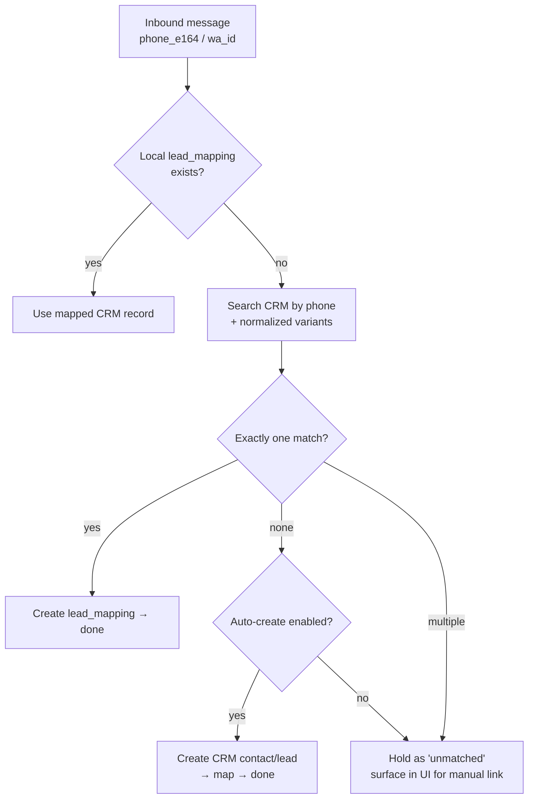
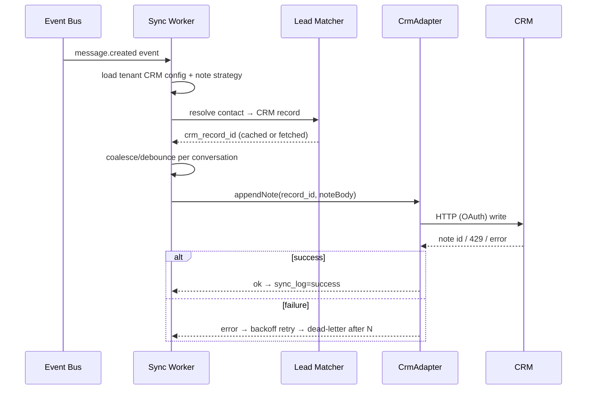

# 03 — API & Data Design

The contracts that hold the system together: the canonical data model, the database schema,
the external APIs, and — the commercially important part — the **pluggable CRM adapter
layer** and how conversations become CRM records *without flooding them*.

---

## 1. Canonical model (provider- and CRM-agnostic)

Everything internal speaks **one** vocabulary. WhatsApp specifics and CRM specifics live
only at the edges (connectors and adapters). This is what makes "support any CRM" and
"swap WhatsApp path" tractable.

```mermaid
erDiagram
    TENANT ||--o{ USER : has
    TENANT ||--o{ WA_CONNECTION : owns
    TENANT ||--o{ CRM_INTEGRATION : configures
    WA_CONNECTION ||--o{ CONVERSATION : produces
    CONTACT ||--o{ CONVERSATION : participates
    CONVERSATION ||--o{ MESSAGE : contains
    CONTACT ||--o{ LEAD_MAPPING : maps
    CRM_INTEGRATION ||--o{ LEAD_MAPPING : targets
    MESSAGE ||--o{ SYNC_LOG : tracked_by

    TENANT { uuid id; string name; string data_region }
    USER { uuid id; uuid tenant_id; string email; string role }
    WA_CONNECTION { uuid id; uuid tenant_id; string phone_e164; string provider; string status }
    CONTACT { uuid id; uuid tenant_id; string wa_id; string phone_e164; string display_name }
    CONVERSATION { uuid id; uuid tenant_id; uuid contact_id; timestamptz last_message_at }
    MESSAGE { uuid id; uuid conversation_id; string direction; string type; text body; string status }
    CRM_INTEGRATION { uuid id; uuid tenant_id; string crm_type; jsonb config; string status }
    LEAD_MAPPING { uuid id; uuid contact_id; uuid crm_integration_id; string crm_record_id }
    SYNC_LOG { uuid id; uuid message_id; uuid crm_integration_id; string status; int attempts }
```

---

## 2. PostgreSQL schema (starter DDL)

Trimmed for readability; add timestamps, soft-delete, and indexes as noted.

```sql
-- Tenancy & users
CREATE TABLE tenant (
  id           uuid PRIMARY KEY DEFAULT gen_random_uuid(),
  name         text NOT NULL,
  data_region  text NOT NULL DEFAULT 'eu',      -- for residency (UAE/DIFC/EU/...)
  created_at   timestamptz NOT NULL DEFAULT now()
);

CREATE TABLE app_user (
  id         uuid PRIMARY KEY DEFAULT gen_random_uuid(),
  tenant_id  uuid NOT NULL REFERENCES tenant(id),
  email      citext NOT NULL,
  role       text NOT NULL DEFAULT 'agent',      -- owner | admin | agent | viewer
  created_at timestamptz NOT NULL DEFAULT now(),
  UNIQUE (tenant_id, email)
);

-- WhatsApp connection (one per linked number)
CREATE TABLE wa_connection (
  id          uuid PRIMARY KEY DEFAULT gen_random_uuid(),
  tenant_id   uuid NOT NULL REFERENCES tenant(id),
  phone_e164  text NOT NULL,
  provider    text NOT NULL,                     -- 'baileys' | 'cloud_api'
  status      text NOT NULL DEFAULT 'disconnected', -- connected|connecting|qr_pending|disconnected|banned
  auth_state  bytea,                             -- ENCRYPTED Baileys creds (Path B)
  waba_id     text,                              -- Path A
  created_at  timestamptz NOT NULL DEFAULT now(),
  UNIQUE (tenant_id, phone_e164)
);

-- Contacts (the other party)
CREATE TABLE contact (
  id           uuid PRIMARY KEY DEFAULT gen_random_uuid(),
  tenant_id    uuid NOT NULL REFERENCES tenant(id),
  wa_id        text,                             -- WhatsApp id
  phone_e164   text NOT NULL,
  display_name text,
  created_at   timestamptz NOT NULL DEFAULT now(),
  UNIQUE (tenant_id, phone_e164)
);
CREATE INDEX ix_contact_tenant_phone ON contact (tenant_id, phone_e164);

CREATE TABLE conversation (
  id              uuid PRIMARY KEY DEFAULT gen_random_uuid(),
  tenant_id       uuid NOT NULL REFERENCES tenant(id),
  contact_id      uuid NOT NULL REFERENCES contact(id),
  wa_connection_id uuid NOT NULL REFERENCES wa_connection(id),
  last_message_at timestamptz,
  created_at      timestamptz NOT NULL DEFAULT now()
);
CREATE INDEX ix_conv_tenant_last ON conversation (tenant_id, last_message_at DESC);

-- Messages — partition by month at scale
CREATE TABLE message (
  id              uuid PRIMARY KEY DEFAULT gen_random_uuid(),
  conversation_id uuid NOT NULL REFERENCES conversation(id),
  tenant_id       uuid NOT NULL,
  wa_message_id   text,                          -- provider id, for idempotency
  direction       text NOT NULL,                 -- 'in' | 'out'
  type            text NOT NULL,                 -- text|image|audio|video|document|location|...
  body            text,
  media_url       text,                          -- object-storage key
  status          text,                          -- queued|sent|delivered|read|failed
  sender          text,
  created_at      timestamptz NOT NULL DEFAULT now(),
  UNIQUE (conversation_id, wa_message_id)        -- dedupe / idempotency
);
CREATE INDEX ix_msg_conv_time ON message (conversation_id, created_at);

-- CRM config (one row per connected CRM per tenant)
CREATE TABLE crm_integration (
  id           uuid PRIMARY KEY DEFAULT gen_random_uuid(),
  tenant_id    uuid NOT NULL REFERENCES tenant(id),
  crm_type     text NOT NULL,                    -- 'hubspot' | 'salesforce' | 'zoho' | 'pipedrive' | 'custom'
  credentials  bytea,                            -- ENCRYPTED OAuth tokens / API keys
  config       jsonb NOT NULL DEFAULT '{}',      -- field mappings, note strategy, etc.
  status       text NOT NULL DEFAULT 'active',
  created_at   timestamptz NOT NULL DEFAULT now()
);

-- Contact ↔ CRM record link
CREATE TABLE lead_mapping (
  id                 uuid PRIMARY KEY DEFAULT gen_random_uuid(),
  contact_id         uuid NOT NULL REFERENCES contact(id),
  crm_integration_id uuid NOT NULL REFERENCES crm_integration(id),
  crm_record_type    text NOT NULL,              -- 'contact' | 'lead' | 'deal'
  crm_record_id      text NOT NULL,
  crm_note_id        text,                        -- the running note/activity id, if appending
  created_at         timestamptz NOT NULL DEFAULT now(),
  UNIQUE (contact_id, crm_integration_id)
);

-- Sync audit / retry tracking
CREATE TABLE sync_log (
  id                 uuid PRIMARY KEY DEFAULT gen_random_uuid(),
  message_id         uuid REFERENCES message(id),
  conversation_id    uuid REFERENCES conversation(id),
  crm_integration_id uuid NOT NULL REFERENCES crm_integration(id),
  status             text NOT NULL,              -- pending|success|failed|dead_letter
  attempts           int NOT NULL DEFAULT 0,
  last_error         text,
  synced_at          timestamptz,
  created_at         timestamptz NOT NULL DEFAULT now()
);

-- Append-only audit trail (security/compliance)
CREATE TABLE audit_log (
  id         bigserial PRIMARY KEY,
  tenant_id  uuid,
  actor      text,
  action     text NOT NULL,
  target     text,
  metadata   jsonb,
  created_at timestamptz NOT NULL DEFAULT now()
);
```

> **Tenancy enforcement:** every query is scoped by `tenant_id`. For defense-in-depth,
> enable **PostgreSQL Row-Level Security (RLS)** keyed on a per-request tenant setting — see
> [04 §4](04-security-privacy-compliance.md).

---

## 3. REST API (frontend ↔ backend)

Versioned under `/api/v1`. JWT auth, tenant derived from token. Representative endpoints:

| Method & path | Purpose |
|---|---|
| `POST /auth/login` · `POST /auth/refresh` | User auth |
| `POST /connections` | Start a WhatsApp connection (returns connection id) |
| `GET  /connections/:id/qr` | Get current QR (Path B) — or poll status via WS |
| `GET  /connections/:id` | Connection status (connected / qr_pending / banned …) |
| `DELETE /connections/:id` | Unlink a number |
| `GET  /conversations?cursor=` | List conversations (paginated, newest first) |
| `GET  /conversations/:id/messages?cursor=` | Message history (cursor pagination) |
| `POST /conversations/:id/messages` | **Send** a message (text/media) |
| `POST /media` | Upload attachment → returns key for sending |
| `GET  /contacts/:id` | Contact + matched lead info |
| `GET  /crm/integrations` · `POST /crm/integrations` | List / connect a CRM |
| `POST /crm/integrations/:id/oauth/callback` | OAuth redirect handler |
| `PUT  /crm/integrations/:id/config` | Field mappings, note strategy |
| `POST /contacts/:id/sync` | Force-sync a contact's thread to CRM |
| `GET  /contacts/:id/export` · `DELETE /contacts/:id` | **GDPR/PDPL** export & erasure |

**Send-message request/response:**

```jsonc
// POST /conversations/{id}/messages
{ "type": "text", "body": "Hi! Following up on your enquiry.",
  "clientMessageId": "c_8f3a..." }   // client-generated, for optimistic UI + idempotency

// 202 Accepted
{ "id": "uuid", "status": "queued", "clientMessageId": "c_8f3a..." }
// status then progresses queued → sent → delivered → read via WebSocket events
```

---

## 4. WebSocket API (real-time)

Single authenticated WS connection per browser; client subscribes to channels. Event
envelope:

```jsonc
{ "type": "message.created",       // event type
  "tenantId": "...", "conversationId": "...",
  "data": { /* message */ }, "ts": 1733000000 }
```

| Event `type` | Meaning |
|---|---|
| `connection.status` | QR ready / connected / disconnected / banned |
| `message.created` | New inbound or outbound message |
| `message.status` | sent / delivered / read / failed update |
| `conversation.updated` | last-message / unread changed |
| `contact.matched` | lead-matching resolved a CRM record |
| `crm.sync.status` | a message/thread synced or failed to sync |

Full flow semantics (ordering, idempotency, backfill) are in
**[05-realtime-sync.md](05-realtime-sync.md)**.

---

## 5. Lead matching (WhatsApp identity → CRM record)

When a message arrives, decide *which CRM record* it belongs to.



Practical rules:
- **Normalize to E.164** and also try national-format variants — phone formats are the #1
  cause of false misses.
- **Cache** mappings in `lead_mapping` so you hit the CRM once per contact, not per message.
- **Per-tenant policy** in `crm_integration.config`: auto-create vs. manual link; whether to
  create a *Lead*, *Contact*, or attach to a *Deal*.
- **Multiple matches → never guess.** Surface for a human to resolve in the UI.

---

## 6. The CRM adapter layer (the commercial core)

### 6.1 The interface
Every CRM implements **one** contract. Adding a CRM = writing one adapter; the rest of the
system is untouched.

```typescript
export interface CrmAdapter {
  readonly type: string; // 'hubspot' | 'salesforce' | ...

  // Auth lifecycle
  getAuthUrl(state: string): string;
  exchangeCode(code: string): Promise<CrmCredentials>;
  refresh(creds: CrmCredentials): Promise<CrmCredentials>;

  // Lead matching
  findContactByPhone(phone: string, creds: CrmCredentials): Promise<CrmRecord[]>;
  createContact(input: ContactInput, creds: CrmCredentials): Promise<CrmRecord>;

  // The actual sync target
  appendNote(recordId: string, note: NoteInput, creds: CrmCredentials): Promise<CrmNoteRef>;
  updateNote?(noteId: string, note: NoteInput, creds: CrmCredentials): Promise<void>;
  logActivity?(recordId: string, activity: ActivityInput, creds: CrmCredentials): Promise<void>;

  // Capability flags so the engine adapts
  capabilities: {
    supportsNoteUpdate: boolean;
    supportsActivities: boolean;
    rateLimitPerMin: number;
  };
}
```

Each CRM maps the canonical concepts to its own primitives:

| Canonical | HubSpot | Salesforce | Zoho CRM | Pipedrive |
|---|---|---|---|---|
| Contact/Lead | Contact / Engagement | Contact / Lead | Contacts / Leads | Person |
| "Note" | Engagement (Note) | Note / Task | Notes | Note |
| "Activity log" | Timeline event | Activity (Task) | Activity | Activity |
| Auth | OAuth2 | OAuth2 (+ API limits) | OAuth2 | OAuth2 / API token |

### 6.2 ⚠️ Don't flood the CRM — the note-writing strategy
**Writing one note per WhatsApp message is the classic mistake.** A 60-message chat becomes
60 CRM notes; sales reps revolt; you hit API rate limits. Offer a configurable **strategy**
per tenant:

| Strategy | How it works | Best for |
|---|---|---|
| **Running thread note** (recommended default) | One note per conversation; **append** each message (or update the same note). `crm_note_id` stored in `lead_mapping`. | Most CRMs, clean timelines |
| **Time-window batch** | Flush buffered messages every N minutes / on inactivity into one note. | High-frequency chats |
| **On-conversation-close** | Write the full transcript when the chat goes idle/resolved. | Ticket-style workflows |
| **AI summary** | Summarize the thread into a short note + extracted fields (see [02 §8](02-architecture.md)). | Premium tier, exec-friendly notes |
| **Per-message** | Literal 1:1 (only if a tenant insists). | Rare / compliance archives |

Implementation notes:
- **Debounce/coalesce** in the sync worker; key by `(conversation_id, crm_integration_id)`.
- **Idempotency:** `sync_log.UNIQUE` on the unit of sync prevents double-writes on retries.
- **Respect CRM rate limits** (`capabilities.rateLimitPerMin`) with a token-bucket per
  integration; queue overflow rather than 429-storm.
- **Media:** push a link to your signed media URL (or upload as a CRM attachment where the
  API supports it).

### 6.3 Sync worker flow



---

## 7. Versioning, errors, and contracts
- **Version the public API** (`/v1`) and the **internal event schema** (a `schemaVersion`
  field) so connectors/adapters can evolve independently.
- Keep canonical types in a **shared package** consumed by every service — one source of
  truth for `Message`, `Contact`, `CrmRecord`, event envelopes.
- Standard error envelope `{ code, message, retriable }`; map provider/CRM errors into it so
  the UI and retry logic don't need provider-specific knowledge.

➡️ Next: **[04-security-privacy-compliance.md](04-security-privacy-compliance.md)**.
