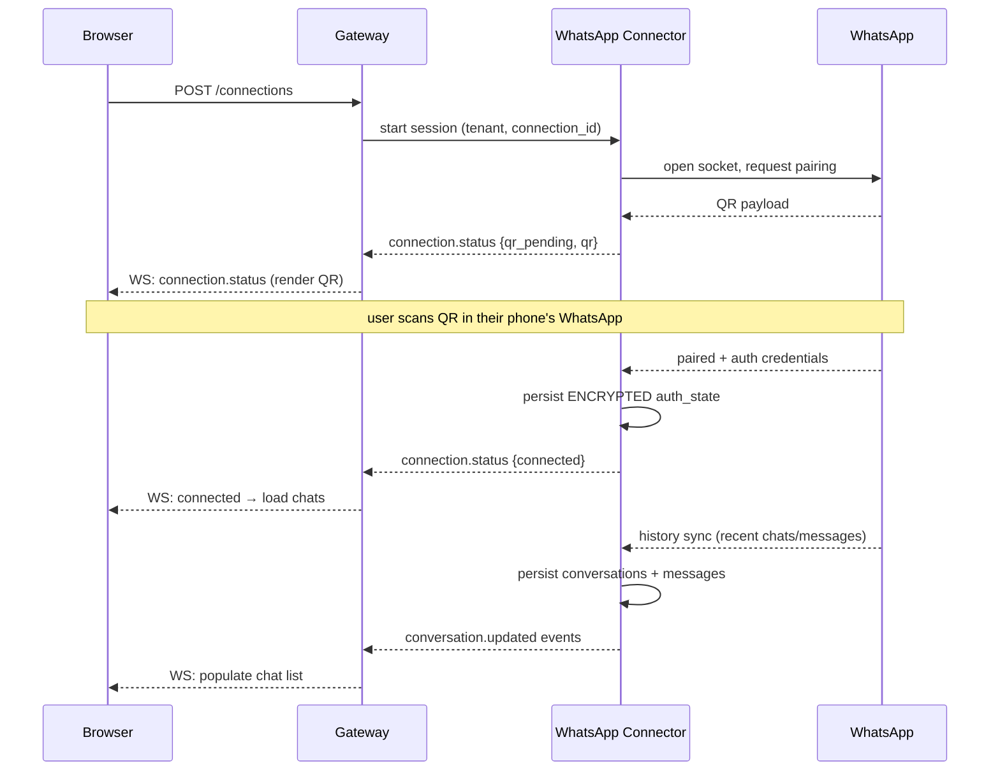
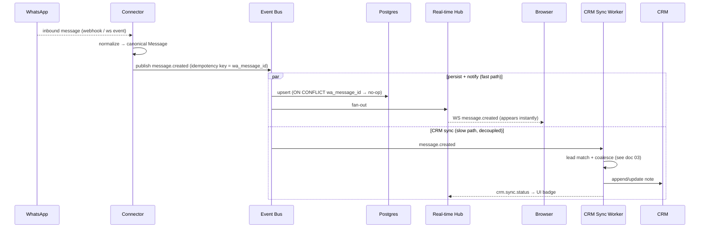
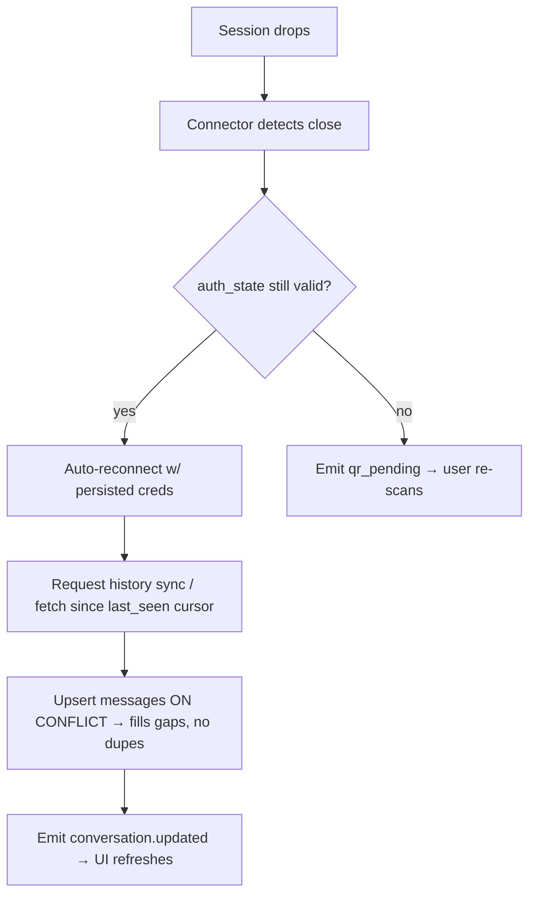

# 05 — Real-Time Message Synchronization

The contract for how a message travels: WhatsApp → your system → the user's screen → the
CRM, and back out again. Get the guarantees here right and the product feels instant and
reliable; get them wrong and you get duplicates, lost messages, and out-of-order chats.

---

## 1. The QR-login / connection flow (Path B)



Notes:
- **QR is short-lived** and rotates; push refreshed QR codes over WS until paired or timeout.
- On **reconnect**, load persisted `auth_state` and resume **without** a new scan. Only when
  WhatsApp invalidates the link do you re-enter `qr_pending`.
- **History sync** depth is limited by the WhatsApp multi-device protocol (recent history,
  not the entire lifetime). Set user expectations accordingly.
- **Path A** has no QR step — onboarding is number registration + webhook configuration.

---

## 2. Inbound message flow (the critical path)



**Why two paths from one event:** the user must see the message **immediately**; the CRM
write is slower and may fail/retry. Never make the user wait on the CRM. The bus decouples
them so a CRM outage can't delay or drop the live chat.

---

## 3. Outbound message flow (with optimistic UI)

```mermaid
sequenceDiagram
    participant UI as Browser
    participant GW as Gateway
    participant WAC as Connector
    participant WA as WhatsApp
    participant BUS as Event Bus
    participant RT as Real-time Hub

    UI->>UI: render bubble immediately (status: sending)<br/>clientMessageId = c_123
    UI->>GW: POST /messages {clientMessageId, body}
    GW->>WAC: send(connection, to, body, clientMessageId)
    WAC->>WA: send
    WA-->>WAC: accepted → wa_message_id
    WAC->>BUS: message.created {direction:out, status:sent, clientMessageId}
    BUS-->>RT-->>UI: reconcile bubble by clientMessageId → status: sent
    WA-->>WAC: delivery receipt → message.status delivered
    WA-->>WAC: read receipt → message.status read
    RT-->>UI: tick updates (✓ → ✓✓ → blue ✓✓)
```

- **Optimistic send:** show the bubble instantly with a client-generated `clientMessageId`;
  reconcile when the server echoes back the real id + status. Prevents the laggy feel.
- **Status lifecycle:** `queued → sent → delivered → read` (or `failed`). Each transition is
  a `message.status` event.
- **Failure:** surface a retry affordance; the original `clientMessageId` makes a manual
  resend idempotent.

---

## 4. Delivery guarantees & idempotency

**Goal: at-least-once delivery + idempotent processing = effectively exactly-once outcomes.**

| Concern | Mechanism |
|---|---|
| Duplicate inbound (retried webhook, reconnect replay) | **`UNIQUE (conversation_id, wa_message_id)`**; persist via `INSERT … ON CONFLICT DO NOTHING` |
| Duplicate outbound (user double-taps, client retry) | `clientMessageId` dedupe at the gateway |
| Duplicate CRM writes (sync retry) | `sync_log` unique per sync unit; check-before-write; reuse stored `crm_note_id` |
| Lost events | Bus persistence (Redis Streams consumer groups / Kafka offsets); ack only after successful persist |
| Poison messages | Retry with backoff → **dead-letter queue** + alert after N attempts |

> **Rule of thumb:** assume every event can arrive **twice** and processing can **crash
> mid-way**. Make every consumer safe to re-run. Idempotency keys are non-negotiable.

---

## 5. Ordering

- **Per-conversation ordering is what users notice**; global ordering doesn't matter.
- Partition the bus **by `conversation_id`** so one conversation's events are processed in
  order by a single consumer.
- Persist a **monotonic sort key** (provider timestamp + a tiebreaker sequence) and **order
  in the UI by that**, not by arrival time — clocks and networks reorder things.
- Late-arriving older messages (e.g., after reconnect/backfill) insert into the correct
  position by sort key rather than appending to the bottom.

---

## 6. Reconnection, gap-filling & backfill

Sessions *will* drop. The system must self-heal without losing or duplicating messages.



- Track a **per-connection `last_seen` cursor**; on reconnect, reconcile anything missed.
- The `ON CONFLICT DO NOTHING` upsert means re-syncing overlapping ranges is **safe** — gaps
  fill, duplicates don't.
- **Browser side:** on WS reconnect, the client re-subscribes and pulls `GET
  /conversations/:id/messages?since=` to catch up, then resumes live.
- **Heartbeats:** WS ping/pong + connection-lease renewal (see [02 §5](02-architecture.md));
  detect dead sessions fast and fail over.

---

## 7. Scaling the real-time layer

- **Multiple WS hub instances** share state via the **Redis adapter** (Socket.IO) or a
  managed provider (Ably/Pusher) — so any hub can deliver to any client.
- **Channels** scoped per tenant + per conversation; authorize subscription server-side
  (a user may only subscribe to conversations they're allowed to see — see
  [04 §4](04-security-privacy-compliance.md)).
- **Backpressure:** if a client is slow/offline, don't buffer unboundedly — drop to a
  "fetch on reconnect" model rather than blowing memory.
- **Presence/typing indicators** are optional niceties; keep them ephemeral (Redis, TTL),
  never persisted.

---

## 8. What the frontend can rely on (the contract)

1. Every message — in or out — arrives as a `message.created` event with a stable `id`,
   `conversationId`, and sort key.
2. Outbound bubbles are reconciled by `clientMessageId`; status arrives via `message.status`.
3. Events may duplicate → the client should **upsert by `id`**, never blind-append.
4. On reconnect, the client **pulls a catch-up page** then resumes the stream; it must
   tolerate overlap.
5. CRM sync is **eventually consistent** and surfaced via `crm.sync.status` — it never blocks
   or delays chat.

➡️ Next: **[06-development-roadmap.md](06-development-roadmap.md)**.
