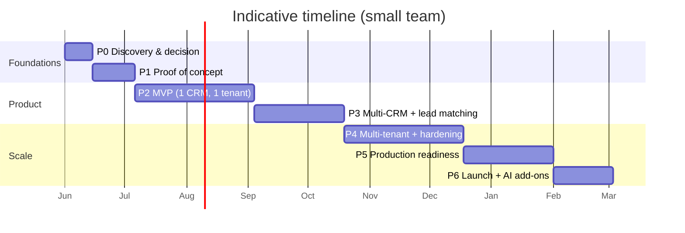

# 06 — Development Roadmap

From a throwaway prototype to a production-ready, multi-tenant product — with milestones,
exit criteria, a testing strategy, cost model, team shape, and risks.

> **Prerequisite gate (do before Phase 0 ends):** leadership signs off on the
> **Path A / B / hybrid** decision from [01](01-feasibility-and-legal.md). Everything below
> assumes the recommended **abstract-the-connector** approach, starting on **Path B (Baileys)**
> for the WhatsApp-Web UX, designed so Path A can be added later.

---

## 1. Phase overview

Rough totals: **PoC ~1 month · MVP ~3 months · production-ready ~6–9 months.**

---

## 2. Phase 0 — Discovery & decision (1–2 weeks)
**Goal:** remove ambiguity and risk before code.
- Finalize **Path A / B / hybrid**; get written sign-off on Path-B ToS/ban risk *or* Path-A
  constraints.
- Pick the **first target CRM** (recommend **HubSpot** — free tier, clean OAuth, great
  docs).
- Confirm **data-residency** needs of first customers (UAE/DIFC/EU).
- Spike: stand up Baileys against a **test number**, confirm QR link + send/receive in a
  throwaway script. *(De-risks the single biggest unknown in an afternoon.)*
- Engage legal for privacy policy + DPA template.

**Exit criteria:** path chosen & signed off; a test number receives a message via Baileys in
a console; first CRM + region decided.

---

## 3. Phase 1 — Proof of Concept (2–3 weeks)
**Goal:** prove the end-to-end spine on one happy path. Throwaway-quality is fine.
- Single connector instance (Baileys) → receives a message → stores in Postgres → pushes to a
  minimal React page over WebSocket → you reply from the page.
- Hard-code one HubSpot token; on inbound message, **append a note** to a matching/created
  contact.
- No multi-tenant, no auth, no scaling.

**Exit criteria:** *"I scan a QR, see my chats, send a reply from the browser, and a note
appears on the HubSpot contact."* Demo-able to stakeholders. **This is your go/no-go moment.**

---

## 4. Phase 2 — MVP (≈2 months)
**Goal:** a real, usable single-tenant product.
- **Frontend:** proper WhatsApp-Web-like UI — QR login, chat list, conversation view (text +
  media + voice notes), composer, status ticks, CRM side-panel.
- **Backend (NestJS):** the `WhatsAppConnector` interface with the Baileys implementation;
  gateway/BFF; real-time hub; **encrypted, persistent `auth_state`** with auto-reconnect.
- **Event bus** (Redis Streams) with the two-path inbound flow ([05 §2](05-realtime-sync.md)).
- **CRM adapter layer** with **one** adapter (HubSpot) behind the interface; **running-thread
  note** strategy ([03 §6](03-api-and-data-design.md)).
- **Auth** (managed provider) + basic RBAC.
- **Idempotency + retries + dead-letter** for sync.
- Core observability (Sentry + structured logs + basic metrics).

**Exit criteria:** one business can connect a number, work their WhatsApp inbox in-app, and
have conversations reliably logged to HubSpot, surviving restarts and reconnects.

---

## 5. Phase 3 — Multi-CRM & robust lead matching (≈6 weeks)
**Goal:** deliver the "any CRM" promise.
- Add **2–3 more adapters** (Salesforce, Zoho, Pipedrive) — proves the abstraction; each new
  CRM should be *just an adapter*, no core changes. If it isn't, fix the interface now.
- **OAuth connect-your-CRM** flow + per-tenant **field-mapping & note-strategy config UI**.
- **Lead-matching service** with normalization, find-or-create, and an **"unmatched" queue**
  for manual linking ([03 §5](03-api-and-data-design.md)).
- Alternate note strategies (batch / on-close).

**Exit criteria:** a user connects any supported CRM via OAuth, configures mapping, and
messages route to the correct records; adding a CRM costs ~1 adapter.

---

## 6. Phase 4 — Multi-tenant & hardening (≈2 months)
**Goal:** turn the app into a SaaS that won't leak or fall over.
- Full **multi-tenancy**: tenant scoping + **Postgres RLS** + cross-tenant isolation tests.
- **Session scaling**: connector as a **StatefulSet** with Redis-lease ownership, failover,
  and rebalancing ([02 §5](02-architecture.md)). Load-test session density.
- **Envelope encryption** (KMS + per-tenant DEK) for all secrets ([04 §3](04-security-privacy-compliance.md)).
- **Data-subject tooling**: export + erasure endpoints; retention jobs; audit log.
- **Per-tenant data region** wiring.
- Full observability: dashboards, alerting (ban detection, sync failures, session drops),
  tracing.

**Exit criteria:** many tenants run isolated; a node dying reclaims its sessions; secrets are
KMS-backed; export/delete works; dashboards are green and alerting fires.

---

## 7. Phase 5 — Production readiness (≈6 weeks)
**Goal:** safe to sell.
- **Independent penetration test** + remediation.
- **Load & soak testing** (k6): message throughput, concurrent sessions, WS fan-out,
  sustained 24h+ session stability.
- **Chaos drills:** kill connector pods, drop WhatsApp sessions, simulate CRM 429s/outages,
  KMS unavailability — verify graceful degradation and recovery.
- **Compliance pack:** privacy policy, DPA, sub-processor list, retention policy,
  breach/incident runbooks.
- **Billing & plans** (if commercial); usage metering.
- Backups with **tested restores**; DR runbook; SLOs defined.

**Exit criteria:** pen test passed, load targets met, runbooks rehearsed, legal pack
complete, backups proven restorable.

---

## 8. Phase 6 — Launch & differentiate (ongoing)
- Onboard pilot customers; tighten UX from real usage.
- **AI add-ons** ([02 §8](02-architecture.md)): conversation→note summarization, sentiment/
  intent tagging, suggested replies, field extraction. Strong premium-tier differentiators.
- Add the **Path A (Cloud API) connector** for enterprise/compliance tier — the abstraction
  means no rewrite, just a new connector + onboarding flow.
- Expand CRM catalog by demand.

---

## 9. Testing strategy (QA across all phases)

| Layer | Tooling | What it proves |
|---|---|---|
| **Unit** | Jest/Vitest | normalization, idempotency keys, adapter mapping, lead-match logic |
| **Contract** | per-CRM adapter test suite against the `CrmAdapter` interface + sandbox accounts | every CRM honors the same contract |
| **Integration** | Testcontainers (Postgres/Redis) + **mocked WhatsApp & CRM** | bus → persist → sync wiring; retries; dead-letter |
| **E2E** | **Playwright** against a staging stack | QR login, send/receive, optimistic UI, CRM note appears |
| **Real-time resilience** | scripted disconnects/reconnects | gap-fill works, **no dupes, no lost messages** |
| **Load/soak** | **k6** + many simulated sessions | throughput, WS fan-out, 24h+ session stability, memory under session density |
| **Security** | SCA (Snyk/Dependabot), container scan (Trivy), secret scan (gitleaks), DAST/ZAP, pen test | OWASP + supply-chain (critical for Path B's fast-moving deps) |
| **Tenant isolation** | dedicated CI suite | Tenant B can never read Tenant A — **release-blocking** |
| **Chaos** | kill pods / drop sessions / fault-inject CRM | graceful degradation + recovery |

**Cross-cutting QA principles**
- Test **idempotency explicitly**: replay the same inbound event twice, assert one row + one
  CRM note.
- Test **failure paths first** — CRM down, session dropped, KMS unavailable, 429s.
- **Never use real customer numbers/data** in test; dedicated test numbers + sandbox CRMs.
- CI gates: lint + typecheck + unit + integration on every PR; E2E + isolation nightly;
  security scans on every build.

---

## 10. Team & roles (lean build)
| Role | Focus |
|---|---|
| Tech lead / backend (1) | connector, bus, sync engine, session scaling |
| Backend (1) | CRM adapters, lead matching, APIs |
| Frontend (1) | WhatsApp-Web UI, real-time client |
| DevOps/SRE (0.5–1) | infra, KMS, observability, CI/CD |
| QA (0.5–1) | test automation, load/chaos, isolation suite |
| PM/compliance (0.5) | roadmap, DPA/privacy, customer onboarding |

A focused team of **3–5** can reach MVP; **5–7** for production SaaS.

---

## 11. Cost model (what drives the bill)
- **Path B:** mostly **infra** — session density dictates compute (Baileys cheap,
  whatsapp-web.js expensive). No per-message fee. Plus KMS, managed Postgres/Redis, object
  storage, monitoring.
- **Path A:** **per-conversation WhatsApp fees** (vary by country/category) **+ BSP fees** +
  infra. Model this against expected conversation volume early — it can dominate.
- **AI add-ons:** per-token LLM costs; gate behind premium tier.
- **Compliance:** pen test, legal review, audits — budget real money for production.

---

## 12. Risk register (top risks & mitigations)
| Risk | Likelihood | Impact | Mitigation |
|---|---|---|---|
| WhatsApp **bans** Path-B numbers | Med–High | High | Dedicated numbers, no cold-blast, rate limits, isolate per tenant, ban detection, **plan Path-A migration** |
| Unofficial library **breaks** on WhatsApp update | Med | Med–High | Pin versions, monitor upstream, abstraction lets you swap, keep Path-A ready |
| **Cross-tenant data leak** | Low | Critical | RLS + scoping + CI isolation tests + pen test |
| **Secret/credential breach** | Low | Critical | Envelope encryption, KMS, per-tenant DEK, no secrets in logs |
| **Privacy non-compliance** (PDPL/GDPR) | Med | High | DPA, consent, export/erasure, residency, legal review |
| **Session-scaling** underestimated | Med | High | Prototype lease model in P4, load-test density early, prefer Baileys |
| **CRM flooding** with notes | Med | Med | Running-thread/batch/AI strategies, debounce, rate-limit |
| CRM API limits / breaking changes | Med | Med | Token-bucket per integration, contract tests, capability flags |

---

## 13. Definition of "production-ready"
- [ ] Path decision signed off; (if B) ToS-risk accepted in writing
- [ ] Multi-tenant with enforced isolation (tested)
- [ ] ≥2 CRM adapters live behind the abstraction
- [ ] Sessions persist, auto-reconnect, fail over across nodes
- [ ] Secrets KMS-encrypted; TLS everywhere; webhooks verified (Path A)
- [ ] Export/erasure + retention + audit live; DPA/privacy pack complete
- [ ] Pen test passed; load/soak/chaos targets met
- [ ] Backups with tested restores; alerting + dashboards; runbooks rehearsed

---

### Where to start tomorrow
1. Get the **Path decision** signed off ([01](01-feasibility-and-legal.md)).
2. Run the **Phase 0 Baileys spike** against a test number.
3. Stand up the **Phase 1 PoC spine** and demo it.

Everything after that is executing Phases 2→6 against this plan.
