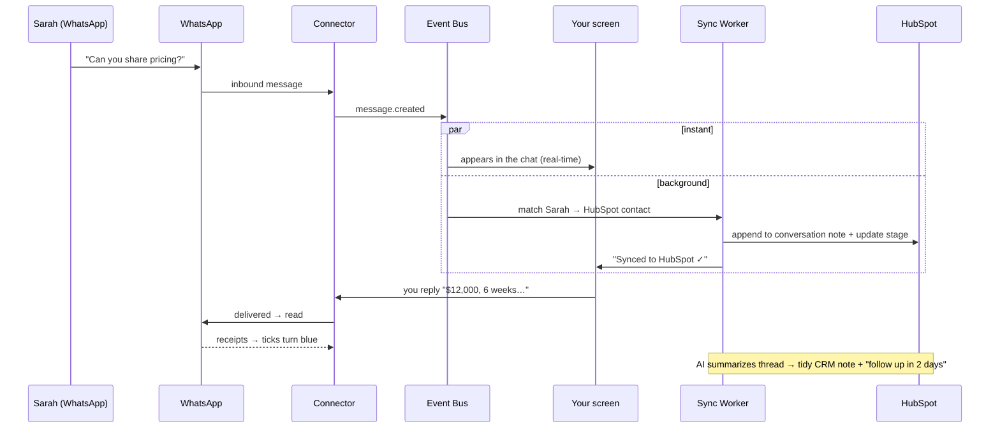

# 07 — Predictive Design, Backend Build & Cost

A walkthrough of **how the product looks**, **what runs behind it**, **how it functions
end-to-end**, and **what it will actually cost you** — for both the build and the monthly
running bill.

> 🖥️ **Open `interface-mockup.html`** (double-click it — it's a single self-contained file,
> works offline) to see the live, clickable design this document describes.

---

## 1. The interface (predictive design)

The mockup renders two states:

### Screen 1 — Connect (QR linking)
A split screen: a branded panel ("Your WhatsApp inbox, wired into your CRM") with the
3-step linking instructions, and a QR code with a **"Simulate scan & connect"** button. It
shows a scanning animation → "Connecting…" → then reveals the app. This is the **Path B**
QR-login flow from [05 §1](05-realtime-sync.md). *(On Path A there's no QR — you'd onboard a
number instead.)*

### Screen 2 — The workspace (four zones)
A familiar WhatsApp-Web layout plus the differentiator (the CRM panel):

```
┌────┬──────────────┬───────────────────────────┬──────────────────┐
│    │  CHAT LIST   │      CONVERSATION         │   CRM CONTEXT    │
│ N  │              │                           │                  │
│ A  │ search +     │  header: name, online,    │  ✓ Synced badge  │
│ V  │ filters      │  "Qualified Lead" pill     │  contact card    │
│    │              │                           │  deal + stages   │
│ R  │ Sarah ●      │  message bubbles (in/out) │  ✨ AI summary    │
│ A  │ Ahmed  ②     │  ticks ✓✓ · doc · voice   │  activity log    │
│ I  │ Priya typing…│  typing indicator         │  [Open in HubSpot]│
│ L  │ +971… UNMATCH│  composer + send          │                  │
└────┴──────────────┴───────────────────────────┴──────────────────┘
```

| Zone | What it shows | Why it matters |
|---|---|---|
| **Nav rail** | Chats, Contacts, CRM, Analytics, Settings, profile | It's a *product*, not just a WhatsApp clone |
| **Chat list** | Connection status (`● Connected as +971…`), search, filters (All/Unread/**Leads**/**Unmatched**), threads with avatars, presence dots, unread badges, **CRM tags** (orange `HUBSPOT` / amber `UNMATCHED`), read ticks, typing state | Surfaces CRM status *per chat* — including the **unmatched** state from [03 §5](03-api-and-data-design.md) |
| **Conversation** | Header with **lead-stage pill**, live presence; message bubbles with timestamps + **status ticks** (sent→delivered→**read** in blue), a **document** message, a **voice note** with waveform, a **typing indicator**; composer with attach/emoji/send | This is the agent's day-to-day; the optimistic-send tick lifecycle is wired live in the mockup |
| **CRM context** | **Sync status** ("Synced to HubSpot · just now"), contact card, **deal card** with stage progress, an **✨ AI summary** with a suggested next step, an **activity timeline**, and actions (Log note / Open in HubSpot) | The whole value proposition in one panel — the rep never leaves the inbox |

Design language: WhatsApp-authentic warm chat canvas and green accents for familiarity,
wrapped in a refined deep-teal product chrome so it reads as a premium SaaS tool. *(Product
name "ChatBridge" is a placeholder.)*

---

## 2. What runs behind each part of the UI (backend work)

Every visible element maps to backend work specified in docs 02–05:

| What you see | What's working behind it |
|---|---|
| QR code + "Connecting…" | **WhatsApp Connector** opens a session, emits the QR over WebSocket, persists **encrypted** auth state, runs history sync ([02 §3.3](02-architecture.md), [05 §1](05-realtime-sync.md)) |
| `● Connected as +971…` | Connection lease + status in Redis/Postgres; heartbeats; auto-reconnect ([02 §5](02-architecture.md)) |
| A new message appears instantly | Connector → **event bus** → persist + **real-time push** over WebSocket (the "fast path") ([05 §2](05-realtime-sync.md)) |
| You type and send | REST `POST /messages` → connector sends → **optimistic UI** reconciled by `clientMessageId`; ticks update from status events ([05 §3](05-realtime-sync.md)) |
| `HUBSPOT` / `UNMATCHED` tags | **Lead-matching service** resolves phone → CRM record, or flags unmatched ([03 §5](03-api-and-data-design.md)) |
| "Synced to HubSpot · just now" | **CRM Sync worker** appended to the running thread note via the **HubSpot adapter**, idempotently ([03 §6](03-api-and-data-design.md)) |
| Deal card, lead-stage pill | Read back from the CRM via the adapter; cached in Postgres |
| ✨ AI summary + next step | Optional **AI consumer** summarizes the thread ([02 §8](02-architecture.md)) |
| Document / voice / image bubbles | **Media service** downloaded from WhatsApp → object storage → signed URL ([02 §3.8](02-architecture.md)) |
| Activity timeline | `sync_log` + `audit_log` events ([03 §2](03-api-and-data-design.md)) |

**The build, in plain terms** — you are constructing:
1. A **stateful WhatsApp connector** (Baileys) that holds sessions and streams events.
2. An **event-driven core** (bus + Postgres + Redis + object storage) that persists and fans
   out messages.
3. A **real-time gateway** pushing to the browser over WebSocket.
4. A **pluggable CRM adapter layer** (start with HubSpot) that turns conversations into notes.
5. A **lead-matching service** mapping phone numbers to CRM records.
6. The **React/Next.js frontend** in the mockup.
7. Cross-cutting **auth, encryption, multi-tenancy, and observability** ([04](04-security-privacy-compliance.md)).

---

## 3. How it functions — one end-to-end story

Following **Sarah** from the mockup:



1. Sarah messages your number. The connector receives it, normalizes it, drops it on the bus.
2. **Instantly** it appears in your chat list and conversation (real-time push).
3. **In parallel**, the sync worker matches her to her HubSpot contact (or flags *unmatched*),
   appends the message to her running conversation note, and updates her lead stage.
4. You reply from the interface; ticks progress to blue when she reads it.
5. The optional AI consumer keeps a clean summary + suggested next step on her record.

The rep does everything from one screen; the CRM stays current with **zero manual data entry**
— that's the product.

---

## 4. 💰 What it will cost you

> All figures are **planning estimates** in **USD** (UAE: ≈ ×3.67 for AED). Real numbers
> depend on scale, region, and who builds it. **Meta's WhatsApp pricing changed in 2025** —
> always re-check current rates for your target countries.

> ### ⚡ "Will I pay WhatsApp per message?" — **No.**
> Per-message fees exist **only on Path A (the official API)**, which we are **not** using.
> On **Path B — the QR-scan approach you want — WhatsApp charges you nothing**: not per
> message, not per month. There are **no Meta fees at all**.
>
> The only thing you pay for is **server hosting** — rent for the always-on computer that
> runs your app 24/7. That is **not** a WhatsApp fee, and for a single-user setup it's tiny
> (or free):
>
> | Setup | What it means | Cost |
> |---|---|---|
> | **Self-hosted** on your own always-on PC | Works only while that machine is on & online; fine for personal/light use | **$0** |
> | **One small cloud server (VPS)** | Always-on, reliable, reachable from anywhere — *recommended* | **~$5–12/mo (≈ AED 18–45)** |
> | + domain name *(optional)* | A nice URL like `app.yourbrand.com` | ~$10/year |
>
> The **AED 220–550/month** figure further down was for a **multi-business SaaS** serving
> many client numbers — **ignore it unless you plan to resell this to other businesses.**

### 4.1 Build cost (one-time)

| Approach | MVP (Path B, 1 CRM, 1 tenant) | To production multi-tenant SaaS |
|---|---|---|
| **You build it (AI-assisted)** — your most likely path | **~$0 cash** + ~6–12 weeks of your time | + ~3–6 months of your time |
| **Freelancers / small offshore team** | **$8k–25k** | **$40k–110k** total |
| **Software agency (UAE/regional)** | **$30k–70k** | **$120k–300k+** total |

Rates vary widely: offshore devs ~$15–40/hr, Eastern Europe ~$30–70/hr, UAE local/agency
~$50–150/hr.

### 4.2 Monthly running cost — **Path B (Baileys, the WhatsApp-Web UX)**

Infra only — **no per-message WhatsApp fees**.

| Stage | Connected numbers | Infra (hosting, Postgres, Redis, storage, monitoring) | WhatsApp fees | **≈ Total / month** |
|---|---|---|---|---|
| **Personal (just you)** | 1 | $0 self-host · ~$5–12 tiny VPS | $0 | **$0–12** |
| **MVP** | 1–10 | $40–120 | $0 | **$40–150** |
| **Growth** | 25–150 | $250–700 | $0 | **$250–800** |
| **Scale** | 500–1,000+ | $1.5k–4k | $0 | **$1.5k–5k** |

*Driver:* session density. Baileys is light (hundreds of sessions/node); whatsapp-web.js is
heavy (a browser each) — **use Baileys** to keep this column small ([02 §5](02-architecture.md)).

### 4.3 Monthly running cost — **Path A (Official Cloud API)**

| Item | Cost |
|---|---|
| Infra (stateless — cheaper than B) | $40–250 at small–mid scale |
| **WhatsApp — service replies** (customer messaged you, reply within 24h) | **Largely free** under current Meta rules |
| **WhatsApp — proactive templates** (marketing/utility/auth) | **Per message**; marketing roughly **$0.01–0.08 each** by country (UAE ~$0.03–0.05, India ~$0.01, US ~$0.025) |
| Example: 1,000 marketing template messages/mo | ≈ **$10–80** |
| BSP fee (Twilio/360dialog — *optional*; direct Meta avoids markup) | $0–50+/mo + per-msg markup |

*Because a CRM inbox is mostly inbound + replies, much of Path A traffic can fall in the
free service window; cost grows mainly with proactive/marketing volume.*

### 4.4 One-off, before going to production (either path)

| Item | Cost |
|---|---|
| Independent **penetration test** | **$3k–15k** |
| **Legal** (UAE privacy policy + DPA template) | **$1k–5k** |
| Domain | ~$12/yr |
| Meta business verification (Path A) | $0 (effort/time) |

### 4.5 Optional add-ons

| Item | Cost |
|---|---|
| **AI summaries/tagging** (LLM usage) | ~$0.001–0.02 per conversation summary; e.g. 5,000/mo ≈ **$5–100** |
| Managed auth (Clerk/Auth0) above free tier | $0–$100+/mo as users grow |
| **Path-B maintenance retainer** (handling WhatsApp breakages) if not DIY | $500–2,000/mo |

### 4.6 Bottom line

- **Just for you (one number, Path B):** **$0** if you run it on your own always-on computer,
  or **~$5–12/month (≈ AED 18–45)** for a small cloud server so it's reliable and reachable
  anywhere. **No WhatsApp/Meta fees, ever** — only your build time.
- **A small multi-business setup (Path B):** ≈ **$60–150/month** (≈ AED 220–550) — *only*
  relevant if you serve several businesses' numbers.
- **To hire the build to production:** ballpark **$40k–120k one-time** (≈ **AED 150k–440k**)
  **+ $250–800/month** running at early scale, **+ ~$5k–20k** pre-launch pen-test & legal.
- **Path A** trades the free messaging of B for compliance and adds **per-message fees** that
  scale with proactive outreach (often modest for reply-driven sales chat).

> The cheapest *real* risk isn't in this table: a **Path-B number ban** can cost you a
> customer relationship. Price that in (and see the mitigations in
> [01 §3](01-feasibility-and-legal.md)).

➡️ Sequencing of all this spend is in the **[06-development-roadmap.md](06-development-roadmap.md)**.
